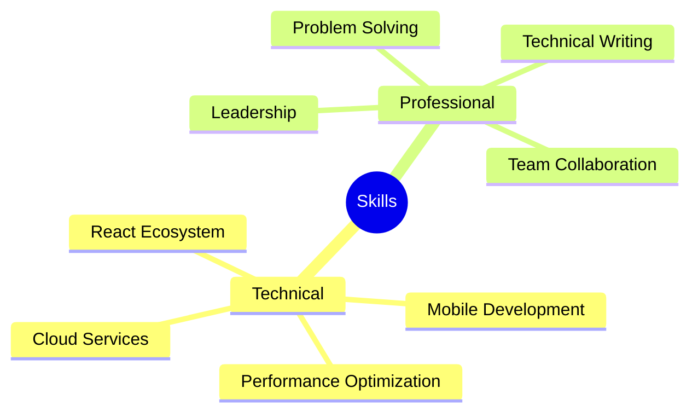

<div align="center">
  
</div>

<div align="center">
  
[](https://linkedin.com/in/YourProfile)
[](mailto:janaksan.jana@gmail.com)
[](YourPortfolioURL)

</div>

## 👨‍💻 About Me

Senior Developer passionate about creating exceptional cross-platform experiences. Specializing in React ecosystem with 7+ years of experience in delivering high-performance applications.

```javascript
const janakshan = {
    code: ["JavaScript", "TypeScript", "HTML", "CSS"],
    technologies: {
        frontend: ["React", "React Native", "Redux", "Material-UI"],
        backend: ["Node.js", "GraphQL", "RESTful APIs"],
        mobile: ["iOS", "Android"],
        cloud: ["AWS", "Firebase"],
        testing: ["Jest", "React Testing Library"]
    },
    architecture: ["Microservices", "Single Page Applications", "Progressive Web Apps"],
    currentFocus: "Building scalable cross-platform applications"
};
```

## 🚀 Tech Stack

<div align="center">


</div>

## 💼 Professional Experience

### 🏢 H3Zoom.ai Platform (2021 - Present)
**Senior Full Stack Developer**
- 🔥 Enhanced platform performance & reduced load times
- 🎨 Developed unified component library
- 📊 Implemented real-time data visualizations
- 📝 Established front-end coding standards

### 🏥 Arogya Smart Hospital System (2019 - 2021)
**Senior Front-End Developer**
- 📱 Built cross-platform healthcare management system
- 🔄 Implemented offline-first architecture
- 🔔 Developed push notification system
- 📊 Created real-time patient monitoring dashboard

### 🎮 Cricrush Platform (2017 - 2019)
**React Native Developer**
- ⚡ Reduced app load time by 40%
- 📦 Created shared component library
- 🚀 Successfully deployed to App Store and Play Store
- 🔄 Integrated real-time WebSocket updates

## 📊 GitHub Stats

<div align="center">
  
[](https://git.io/streak-stats)

[](https://github.com/anuraghazra/github-readme-stats)

</div>

## 🎓 Education

- 🎓 **BSc (Hons) in Software Engineering**
  - Cardiff Metropolitan University (2018)
- 📚 **BTEC Level 5 HND in Software Development**
  - IIS City Campus (2014)

## 🌟 Core Competencies



## 📫 Connect With Me

- 📧 Email: janaksan.jana@gmail.com
- 📍 Location: Jaffna, Sri Lanka
- 📞 Phone: (+94) 777-593-402

## 🌐 Languages

- 🇺🇸 English (Professional Working)
- 🇱🇰 Tamil (Native)

---

<div align="center">
  
[](https://github.com/YourGitHubUsername)


</div>
